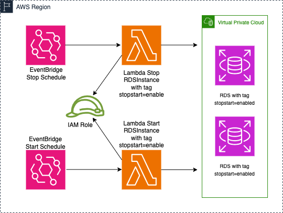

# AWS RDS Scheduler to STOP and START RDS Instances

## This Terraform module deploys

- Lambda Function to Stop RDS Instances with specific Tag
- Lambda Function to Start RDS Instances with specific Tag
- EventBridge Rule to Stop RDS Instances by CRON schedule
- EventBridge Rule to Start RDS Instances by CRON schedule
- CloudWatch Log Group for Lambda Stop RDS
- CloudWatch Log Group for Lambda Start RDS
- IAM Role with IAM Policy to Describe/Stop/Start RDS



>__Note__  
**Cron schedules are in UTC time Zone!**

Cron Expression examples:

- <https://docs.aws.amazon.com/eventbridge/latest/userguide/eb-create-rule-schedule.html>
- <https://docs.aws.amazon.com/lambda/latest/dg/services-cloudwatchevents-expressions.html>

Examples:

```bash
start_cron_schedule = "cron(00 07 * * ? *)"  # Start Servers at 07:00 UTC
stop_cron_schedule  = "cron(00 17 * * ? *)"  # Stop  Servers at 17:00 UTC
```

How to use with all Default:

```hcl
module "rds_scheduler_default" {
  source = "./modules/rds_scheduler"
}
```

How to use with all Custom:

```hcl
module "rds_scheduler_custom" {
  source = "./modules/rds_scheduler"
  name                = "my-rds-scheduler"
  stop_cron_schedule  = "cron(00 16 * * ? *)"
  start_cron_schedule = "cron(00 08 * * ? *)"

  stopstart_tags = {
    TagKEY   = "stopstart_me"
    TagVALUE = "yes"
  }

  tags = {
    Owner = ACME
    Env   = Dev
  }
}

```

This module outputs the ARNs of the Lambda functions for each action.
